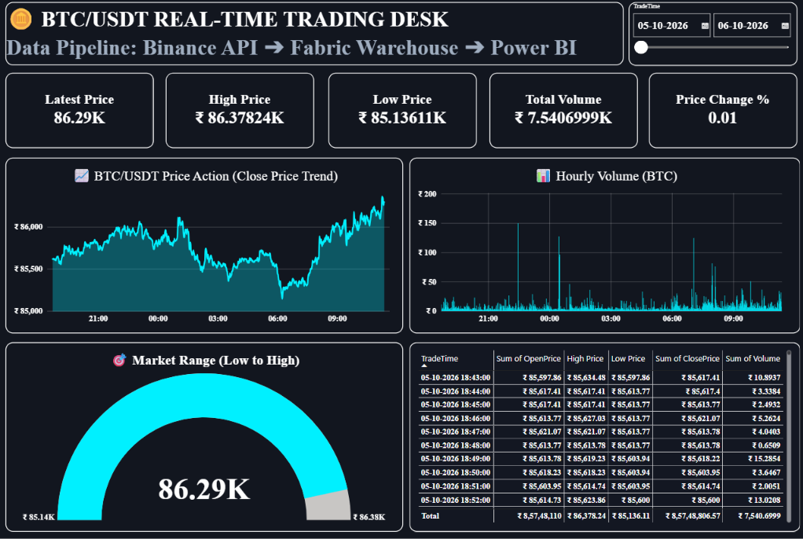

# 🪙 Real-Time Crypto Data Engineering & Analytics Pipeline

An end-to-end cloud Data Engineering project ingesting live market data from the **Binance REST API**, transforming and staging it via **Microsoft Fabric Dataflow Gen2**, storing it in a **Fabric Data Warehouse**, and visualizing it through an automated **Dark-Themed Power BI Trading Desk**.

---

## 📊 Dashboard Preview

---

## 🏗️ Architecture Flow
[ Binance REST API ] ──► [ Fabric Dataflow Gen2 (ETL) ] ──► [ Fabric Data Warehouse ] ──► [ Power BI Dashboard ]
(Source) (Scheduled Orchestration) (SQL Storage) (Direct Lake)
---

## 🛠️ Tech Stack & Skills
- **Source:** Binance Public Market REST API (JSON)
- **ETL / Orchestration:** Microsoft Fabric Dataflow Gen2 & Data Factory
- **Data Warehousing:** Microsoft Fabric Synapse SQL Warehouse (T-SQL, Star Schema)
- **Business Intelligence:** Power BI Desktop / Service, DAX (Dynamic KPIs), Direct Lake
- **Languages / Tools:** T-SQL, Power Query M, DAX

---

## ⚙️ Pipeline Highlights
1. **API Ingestion:** Ingested 1,000+ rows of 1-minute OHLCV Bitcoin trading records.
2. **Data Transformation (Power Query M):**
   - Extracted nested JSON structure into structured columns.
   - Converted Unix Epoch milliseconds into readable `DATETIME2` format.
   - Enforced strict numeric typing for high-precision financial decimals.
3. **Data Warehousing:** Configured high-performance tables in Fabric SQL Data Warehouse.
4. **Automated Scheduling:** Configured automated background refresh triggers.
5. **Analytics & DAX:**
   - Dynamic DAX measures: `Latest Price`, `Session High`, `Session Low`, `Total Volume`, and `Price Change %`.
   - Interactive timeframe zoom slicers.
